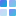

#  Quilt

**Create beautiful image collages right in your browser.** Quilt is a single-file, zero-dependency HTML application that lets you arrange images into custom-sized collages with multiple layout algorithms, interactive cropping, and high-resolution export.

  <a href="https://quilt.jfsen.org"><strong>🌐 quilt.jfsen.org</strong></a>

---

## Features

- **Multiple Layouts** — Choose from seven distinct collage styles:
  - **Equal Grid** — Automatically picks the best-fit grid (rows × columns) based on your images' aspect ratios.
  - **Priority-Weighted Grid** — Uses a squarified treemap algorithm to distribute space proportionally to each image's priority.
  - **Horizontal Strip** — All images in a single row, widths scaled by priority.
  - **Vertical Strip** — All images in a single column, heights scaled by priority.
  - **Hero + Grid** — The first image takes a large left-column area; the rest fill a compact grid on the right.
  - **Hero + Priority** — Like Hero + Grid, but the right-side cells are sized by the priority-weighted treemap algorithm instead of equally.
  - **Masonry** — Fixed-width columns with flowing top-to-bottom placement, preserving each image's natural aspect ratio. Canvas height is auto-computed from content.
- **Priority Sliders** — Fine-tune how much space each image gets in priority-based layouts.
- **Drag & Drop Reordering** — Rearrange images by dragging them in the sidebar list.
- **Interactive Cropping** — Click any cell in the collage, then drag to adjust how the image is framed within its cell. Crop hints show which direction is available.
- **Export at Full Resolution** — Download your collage as **PNG** (lossless, transparent background), **JPG (high quality)**, or **JPG (low quality)** at the exact canvas dimensions you chose — no resolution limits.
- **Custom Canvas Size** — Set your canvas from 200×200 up to 8000×8000 pixels.
- **Keyboard Shortcuts** — Fine-tune crops with arrow keys, reset with `R`, deselect with `Escape`.

---

## Getting Started

1. Open `index.html` in any modern browser.
2. Click **Import Images** and select one or more images.
3. Adjust the canvas size and layout to your liking.
4. Drag images to reorder, and use the priority sliders to control sizing.
5. Click a cell in the preview and drag to crop the image within its cell.
6. Click **Download Collage** to save the result.

That's it — no installation, no server, no dependencies.

---

## Layouts Explained

| Layout | Description |
|---|---|
| **Equal Grid** | Every image gets an equal-sized cell. The algorithm picks the grid (e.g. 2×3 vs 3×2) that best matches the average aspect ratio of your images, minimizing empty cells. |
| **Priority-Weighted Grid** | Space is divided using a squarified treemap algorithm. Each image's cell area is proportional to its priority value, while preserving the image order and keeping cells as square as possible. |
| **Horizontal Strip** | All images sit in one horizontal row. Each image's width is proportional to its priority relative to the total. |
| **Vertical Strip** | All images sit in one vertical column. Each image's height is proportional to its priority. |
| **Hero + Grid** | The first image occupies the left 55% of the canvas (full height). Remaining images tile the right side using the same algorithm as Equal Grid. Rearrange images to pick which one features as the hero. |
| **Hero + Priority** | Same as Hero + Grid, but the remaining images on the right are sized by priority using the squarified treemap algorithm. High-priority images get more space. |
| **Masonry** | Images are placed into auto-picked columns (2–5 depending on image count), each preserving its natural aspect ratio. Each image goes into the shortest column (greedy bin-packing). Canvas height is auto-computed — set the width, and the height emerges from the content. |

---

## Keyboard Shortcuts

| Key | Action |
|---|---|
| `←` `→` `↑` `↓` | Nudge crop of the selected cell (5 px per step) |
| `R` | Reset crop to center for the selected cell |
| `Escape` | Deselect the active cell |

---

## Export Format

- **PNG (lossless)** — Best for preserving detail and transparency. Uses high-quality image resampling. Empty areas are left transparent.
- **JPG (high quality)** — Smaller file size with high-quality resampling and JPEG quality 0.92.
- **JPG (low quality)** — Smallest file size. Uses standard resampling at JPEG quality 0.65 for quick sharing.

Select your preferred format in the sidebar before downloading.

---

## Technical Details

Quilt is **a single HTML file** with all CSS and JavaScript inlined. There are zero external dependencies, build steps, or server requirements. Just open it and use it.

Works in all modern browsers (Chrome, Firefox, Safari, Edge).

---

## License

This project is licensed under the **GNU General Public License v3**. See [LICENSE](LICENSE) for details.
